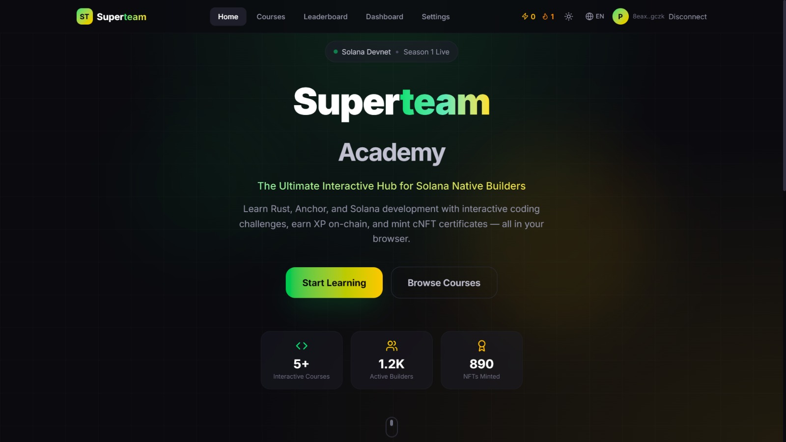

<div align="center">

# Superteam Academy



### The Ultimate Interactive Learning Hub for Solana Native Builders

[](https://superteam-academy-wheat.vercel.app)
[](https://solana.com)
[](https://nextjs.org)
[](https://www.typescriptlang.org)
[](https://tailwindcss.com)
[](LICENSE)

**5 Courses** &bull; **15 Interactive Lessons** &bull; **3 Languages** &bull; **10 Achievements** &bull; **cNFT Certificates**

[Live Demo](https://superteam-academy-wheat.vercel.app) &bull; [Report Bug](https://github.com/panzauto46-bot/superteam-academy/issues) &bull; [Request Feature](https://github.com/panzauto46-bot/superteam-academy/issues)

</div>

---

## About The Project

**Superteam Academy** is an open-source, gamified Learning Management System (LMS) built specifically for the **Solana ecosystem**. It combines an in-browser code editor, Web3 wallet authentication, on-chain XP gamification, and compressed NFT certificates to transform curious developers into shipping Solana builders.

Built for the [Superteam Indonesia](https://id.superteam.fun/) community, the platform provides a structured path from zero to Solana developer through hands-on coding challenges covering Rust, Anchor Framework, Web3.js, SPL Tokens, and NFTs with Metaplex.

### Why Superteam Academy?

| Problem | Solution |
|---------|----------|
| Solana learning resources are scattered | Structured curriculum with 5 courses & 15 lessons |
| No hands-on practice environment | In-browser Monaco Editor with real-time validation |
| Learning feels isolated | Leaderboard, XP system, streaks & achievements |
| No proof of completion | Compressed NFT certificates via Metaplex Bubblegum |
| Language barriers in Southeast Asia | Multi-language support (EN, ID, ES) |

---

## Key Features

### Interactive Code Editor
Write and test **Rust**, **TypeScript**, and **Anchor** code directly in the browser powered by **Monaco Editor** (the same editor that powers VS Code). Split-screen layout lets you read lesson instructions on the left while coding on the right, with real-time syntax highlighting and keyword-based validation.

### Web3 Gamification Engine
- **XP Token System** &mdash; Earn experience points for every completed lesson and course
- **Level Progression** &mdash; Advance from *Novice* (Lv.1) through *Builder*, *Architect*, up to *Grandmaster* with an exponential XP formula
- **Daily Streaks** &mdash; Track your learning consistency with a GitHub-style activity heatmap
- **Skill Radar** &mdash; Visualize proficiency across 6 domains: Rust, Anchor, DeFi, Frontend, NFTs, Security
- **10 Achievements** &mdash; Unlock badges like *First Lesson*, *Streak Master*, *NFT Minter*, and more

### Multi-Authentication System
- **Wallet Login** &mdash; Connect with **Phantom** or **Solflare** for native Web3 authentication
- **Social Login** &mdash; One-click sign-up via **Google** or **GitHub** (powered by NextAuth.js v5)
- **Unified Profile** &mdash; Link wallet address to social identity for a persistent cross-session profile

### Dashboard & Analytics
- **Personal Dashboard** &mdash; Track XP, level, skill radar, activity heatmap, and course progress
- **Global Leaderboard** &mdash; Compete with other builders ranked by XP with level badges
- **Course Progress** &mdash; Visual progress bars, completion percentages, and lesson tracking

### Compressed NFT Certificates
Upon course completion, mint a **compressed NFT (cNFT)** certificate via **Metaplex Bubblegum** on Solana Devnet. Prove your skills on-chain with verifiable, cost-efficient certificates stored on Solana's state compression tree.

### Internationalization (i18n)
Full multi-language support with custom translation context:
- **English (US)** &mdash; Default
- **Bahasa Indonesia** &mdash; For Superteam ID community
- **Espa&ntilde;ol** &mdash; Spanish

### Content Management
Integrated **Sanity.io** headless CMS with custom schemas for courses, modules, lessons, and authors. Manage educational content through the built-in `/studio` admin panel without touching code.

---

## Course Catalog

| # | Course | Level | Lessons | XP | Duration | Topics |
|---|--------|-------|---------|-----|----------|--------|
| 1 | **Solana 101: Foundations** | Beginner | 3 | 500 | ~1.5h | Accounts, Transactions, Programs |
| 2 | **Anchor Framework Essentials** | Intermediate | 3 | 750 | ~2h | IDL, Instructions, State Management |
| 3 | **Solana Web3.js Client** | Beginner | 3 | 500 | ~1.5h | Connection, Keypairs, Transfers |
| 4 | **SPL Token Mastery** | Intermediate | 3 | 750 | ~2h | Token Program, Minting, Transfers |
| 5 | **NFTs with Metaplex** | Advanced | 3 | 1,000 | ~2.5h | Candy Machine, Metadata, Bubblegum |

**Total: 5 courses, 15 lessons, 3,500+ XP available**

---

## Tech Stack

<div align="center">

| Layer | Technology | Purpose |
|-------|-----------|---------|
| **Framework** | [Next.js 15](https://nextjs.org/) (App Router) | Server/client rendering, routing, API routes |
| **Language** | [TypeScript 5](https://www.typescriptlang.org/) | Type-safe development |
| **Styling** | [Tailwind CSS 4](https://tailwindcss.com/) + [shadcn/ui](https://ui.shadcn.com/) | Utility-first CSS + accessible components |
| **Code Editor** | [Monaco Editor](https://microsoft.github.io/monaco-editor/) | In-browser IDE (VS Code engine) |
| **Charts** | [Recharts](https://recharts.org/) + [Calendar Heatmap](https://github.com/kevinsqi/react-calendar-heatmap) | Skill radar & activity visualization |
| **Authentication** | [NextAuth.js v5](https://authjs.dev/) + [Wallet Adapter](https://github.com/solana-labs/wallet-adapter) | Social + Web3 wallet auth |
| **Blockchain** | [Solana Web3.js](https://solana-labs.github.io/solana-web3.js/) + [Helius DAS API](https://docs.helius.dev/) | On-chain interactions & NFT fetching |
| **CMS** | [Sanity.io](https://www.sanity.io/) | Headless content management |
| **Monitoring** | [Sentry](https://sentry.io/) | Error tracking & performance |
| **Analytics** | [Google Analytics 4](https://analytics.google.com/) | User behavior tracking |
| **Deployment** | [Vercel](https://vercel.com/) | Edge deployment & CI/CD |

</div>

---

## Architecture

### Project Structure

```
superteam-academy/
├── app/                              # Next.js application root
│   ├── src/
│   │   ├── app/                      # App Router (file-based routing)
│   │   │   ├── (site)/               # Public website route group
│   │   │   │   ├── (main)/           # Pages with shared Navbar + Footer
│   │   │   │   │   ├── page.tsx              # / - Landing page
│   │   │   │   │   ├── courses/
│   │   │   │   │   │   ├── page.tsx          # /courses - Course catalog
│   │   │   │   │   │   └── [slug]/page.tsx   # /courses/:slug - Course detail
│   │   │   │   │   ├── dashboard/page.tsx    # /dashboard - User analytics
│   │   │   │   │   ├── leaderboard/page.tsx  # /leaderboard - XP rankings
│   │   │   │   │   ├── profile/page.tsx      # /profile - User profile
│   │   │   │   │   ├── settings/page.tsx     # /settings - Preferences
│   │   │   │   │   └── layout.tsx            # Shared Navbar + Footer layout
│   │   │   │   ├── lesson/
│   │   │   │   │   └── [courseId]/page.tsx    # /lesson/:id - Full-screen IDE
│   │   │   │   ├── layout.tsx                # Site-wide providers
│   │   │   │   └── providers.tsx             # Context provider composition
│   │   │   ├── (studio)/             # Sanity CMS admin panel
│   │   │   │   ├── studio/[[...tool]]/page.tsx  # /studio - CMS dashboard
│   │   │   │   └── layout.tsx
│   │   │   ├── api/                  # Serverless API routes
│   │   │   │   ├── auth/[...nextauth]/route.ts  # OAuth handlers
│   │   │   │   └── nfts/[wallet]/route.ts       # Helius DAS NFT lookup
│   │   │   ├── layout.tsx            # Root layout (HTML, fonts)
│   │   │   └── global-error.tsx      # Sentry error boundary
│   │   │
│   │   ├── components/               # React components
│   │   │   ├── dashboard/            # SkillRadar, ActivityHeatmap
│   │   │   ├── layout/               # Navbar, Footer
│   │   │   ├── shared/               # AuthModal, CodeEditor, Hero
│   │   │   └── ui/                   # shadcn/ui primitives (6 components)
│   │   │
│   │   ├── contexts/                 # React Context providers
│   │   │   ├── AuthContext.tsx        # User auth, XP, achievements, wallet
│   │   │   ├── LanguageContext.tsx    # i18n language switching
│   │   │   ├── ThemeContext.tsx       # Dark/light mode toggle
│   │   │   ├── ServiceContext.tsx     # Service layer dependency injection
│   │   │   └── WalletProvider.tsx     # Solana wallet adapter wrapper
│   │   │
│   │   ├── data/
│   │   │   └── courses.ts            # 5 courses, 15 lessons, 10 achievements
│   │   │
│   │   ├── services/                 # Clean architecture service layer
│   │   │   ├── interfaces.ts         # Service contracts (swap local/onchain)
│   │   │   └── local/                # LocalStorage implementations
│   │   │       ├── enrollmentService.ts
│   │   │       ├── lessonCompletionService.ts
│   │   │       ├── userService.ts
│   │   │       └── storage.ts
│   │   │
│   │   ├── hooks/                    # Custom hooks (useNFTs)
│   │   ├── i18n/                     # Translation strings (EN, ID, ES)
│   │   ├── lib/                      # Auth config, utilities
│   │   ├── sanity/                   # CMS schemas (course, lesson, module, author)
│   │   └── types/                    # TypeScript declarations
│   │
│   ├── public/                       # Static assets
│   ├── next.config.ts                # Next.js + Sentry config
│   ├── tailwind.config.ts            # Tailwind CSS config
│   ├── tsconfig.json                 # TypeScript config
│   └── package.json                  # Dependencies
│
├── onchain-academy/                  # Solana Anchor programs (future)
├── docs/                             # Documentation & assets
├── scripts/                          # Build & deploy scripts
├── LICENSE                           # MIT License
└── README.md                         # You are here
```

### Architecture Diagram

```
┌─────────────────────────────────────────────────────────┐
│                    PRESENTATION LAYER                     │
│  ┌─────────┐  ┌──────────┐  ┌─────────┐  ┌───────────┐ │
│  │  Pages   │  │Components│  │Contexts │  │  Hooks    │ │
│  │ (9 routes│  │(13 total)│  │(5 global)│  │(useNFTs) │ │
│  └────┬─────┘  └────┬─────┘  └────┬────┘  └─────┬────┘ │
├───────┼──────────────┼────────────┼──────────────┼──────┤
│                    SERVICE LAYER                          │
│  ┌──────────────────────────────────────────────────┐    │
│  │  interfaces.ts (Clean Service Contracts)          │    │
│  │  ├── IEnrollmentService                           │    │
│  │  ├── ILessonCompletionService                     │    │
│  │  ├── ICertificateService (cNFT minting)           │    │
│  │  └── IXPTokenService                              │    │
│  └──────────────────┬───────────────────────────────┘    │
│          ┌──────────┴──────────┐                         │
│    ┌─────┴─────┐        ┌─────┴──────┐                   │
│    │   LOCAL    │        │  ON-CHAIN  │                   │
│    │ localStorage│       │  Anchor    │                   │
│    │ (Current)  │        │  (Future)  │                   │
│    └────────────┘        └────────────┘                   │
├──────────────────────────────────────────────────────────┤
│                    EXTERNAL SERVICES                      │
│  ┌─────────┐ ┌──────────┐ ┌────────┐ ┌───────────────┐  │
│  │Sanity.io│ │NextAuth  │ │Helius  │ │Solana Devnet  │  │
│  │  CMS    │ │  v5      │ │DAS API │ │  (Web3.js)    │  │
│  └─────────┘ └──────────┘ └────────┘ └───────────────┘  │
└──────────────────────────────────────────────────────────┘
```

---

## Getting Started

### Prerequisites

- **Node.js** 18+ ([Download](https://nodejs.org/))
- **npm** 9+ (bundled with Node.js)
- **Solana Wallet** &mdash; [Phantom](https://phantom.app/) or [Solflare](https://solflare.com/) browser extension
- **Sanity.io Account** &mdash; [Free tier](https://www.sanity.io/) (optional, for CMS features)

### Quick Start

```bash
# 1. Clone the repository
git clone https://github.com/panzauto46-bot/superteam-academy.git
cd superteam-academy/app

# 2. Install dependencies
npm install --legacy-peer-deps

# 3. Set up environment variables
cp .env.example .env.local
# Edit .env.local with your keys (see Environment Variables section)

# 4. Start the development server
npm run dev

# 5. Open http://localhost:3000
```

### Environment Variables

Create a `.env.local` file in the `app/` directory:

```env
# ──────────────────────────────────────
# Sanity CMS (Required for /studio)
# ──────────────────────────────────────
NEXT_PUBLIC_SANITY_PROJECT_ID=your_sanity_project_id
NEXT_PUBLIC_SANITY_DATASET=production
NEXT_PUBLIC_SANITY_API_VERSION=2024-02-01

# ──────────────────────────────────────
# NextAuth.js (Required for auth)
# ──────────────────────────────────────
AUTH_SECRET=your_random_secret_key     # Generate: openssl rand -base64 32
NEXTAUTH_URL=http://localhost:3000

# ──────────────────────────────────────
# Social OAuth Providers (Optional)
# ──────────────────────────────────────
GOOGLE_CLIENT_ID=your_google_client_id
GOOGLE_CLIENT_SECRET=your_google_client_secret
GITHUB_ID=your_github_client_id
GITHUB_SECRET=your_github_client_secret

# ──────────────────────────────────────
# Helius RPC (Optional, for NFT fetching)
# ──────────────────────────────────────
HELIUS_API_KEY=your_helius_api_key

# ──────────────────────────────────────
# Sentry (Optional, for error tracking)
# ──────────────────────────────────────
SENTRY_DSN=your_sentry_dsn
NEXT_PUBLIC_SENTRY_DSN=your_sentry_dsn
```

### Available Scripts

| Command | Description |
|---------|-------------|
| `npm run dev` | Start development server on `localhost:3000` |
| `npm run build` | Create optimized production build |
| `npm run start` | Start production server |
| `npm run lint` | Run ESLint for code quality checks |

---

## Pages & Routes

| Route | Page | Auth Required | Description |
|-------|------|:---:|-------------|
| `/` | Home | No | Landing page with hero, features, CTA |
| `/courses` | Course Catalog | No | Browse all 5 available courses |
| `/courses/:slug` | Course Detail | No | Course overview, objectives, lesson list |
| `/lesson/:courseId` | Lesson IDE | Yes | Full-screen split: instructions + code editor |
| `/dashboard` | Dashboard | Yes | XP, level, skill radar, heatmap, progress |
| `/leaderboard` | Leaderboard | No | Global XP rankings with level badges |
| `/profile` | Profile | Yes | User profile with wallet & NFT display |
| `/settings` | Settings | Yes | Theme, language, notifications preferences |
| `/studio` | CMS Admin | No | Sanity Studio for content management |

---

## Roadmap

### Phase 1: Concept & UI/UX Design &nbsp; `COMPLETED`
- [x] Project vision & target audience definition
- [x] Wireframing & UI/UX design (dark-first, glassmorphism)
- [x] Initial prototype with Vite + React

### Phase 2: Next.js Migration &nbsp; `COMPLETED`
- [x] Migrate from Vite to Next.js 15 App Router
- [x] Implement route groups `(main)` and `lesson/[courseId]`
- [x] Set up Tailwind CSS 4 + shadcn/ui component library
- [x] Configure TypeScript with strict mode

### Phase 3: Core Features &nbsp; `COMPLETED`
- [x] Multi-auth system (Phantom, Solflare, Google, GitHub)
- [x] In-browser Monaco Editor with syntax highlighting
- [x] Split-screen lesson layout (instructions + code)
- [x] Dark/light theme toggle with system preference detection
- [x] Multi-language support (English, Bahasa Indonesia, Spanish)

### Phase 4: LMS Engine & Gamification &nbsp; `COMPLETED`
- [x] Clean service layer architecture (interfaces + local implementations)
- [x] Course enrollment & lesson completion tracking
- [x] XP token system with exponential level progression
- [x] Daily streak tracking with activity heatmap
- [x] Skill radar chart (Rust, Anchor, DeFi, Frontend, NFTs, Security)
- [x] 10 achievement badges with unlock conditions
- [x] Global leaderboard with user injection
- [x] Settings page (profile, theme, language, notifications)

### Phase 5: Polish & Deployment &nbsp; `COMPLETED`
- [x] Sanity.io CMS integration with custom schemas
- [x] Helius DAS API for cNFT certificate fetching
- [x] Sentry error monitoring & performance tracking
- [x] Google Analytics 4 integration
- [x] Lighthouse performance optimizations
- [x] Vercel production deployment with CI/CD
- [x] Security patch (Next.js CVE-2025-66478)

### Phase 6: On-Chain Integration &nbsp; `IN PROGRESS`
- [ ] Deploy Anchor programs to Solana Devnet
- [ ] Connect XP token minting to on-chain program
- [ ] Implement real cNFT certificate minting via Metaplex Bubblegum
- [ ] Migrate service layer from `local/` to `onchain/` implementations
- [ ] Add wallet-based progress persistence (on-chain state)

### Phase 7: Production & Scale &nbsp; `PLANNED`
- [ ] Migrate to Solana Mainnet-Beta
- [ ] Add community-contributed courses
- [ ] Implement course rating & review system
- [ ] Add multiplayer coding challenges
- [ ] Launch Superteam Academy DAO for governance

---

## Contributing

We welcome contributions from the Solana community! Whether you're fixing bugs, adding courses, improving translations, or enhancing the UI.

### How to Contribute

1. **Fork** the repository
2. **Create** your feature branch
   ```bash
   git checkout -b feature/amazing-feature
   ```
3. **Commit** your changes
   ```bash
   git commit -m 'feat: add amazing feature'
   ```
4. **Push** to the branch
   ```bash
   git push origin feature/amazing-feature
   ```
5. **Open** a Pull Request

### Contribution Ideas

- Add new courses or lessons (Rust, DeFi, DAO)
- Translate to more languages (Portuguese, Japanese, Korean)
- Improve accessibility (ARIA labels, keyboard navigation)
- Write unit/integration tests
- Optimize bundle size and performance

---

## License

Distributed under the **MIT License**. See [`LICENSE`](LICENSE) for more information.

---

## Acknowledgments

- [Superteam Indonesia](https://id.superteam.fun/) &mdash; Community & ecosystem support
- [Solana Foundation](https://solana.org/) &mdash; Blockchain infrastructure
- [Metaplex](https://www.metaplex.com/) &mdash; NFT standards & Bubblegum protocol
- [Helius](https://helius.dev/) &mdash; RPC & DAS API for compressed NFTs
- [Vercel](https://vercel.com/) &mdash; Deployment & hosting platform
- [shadcn/ui](https://ui.shadcn.com/) &mdash; Beautiful, accessible UI components

---

<div align="center">

**Built with dedication for the Solana ecosystem**

[Superteam Indonesia](https://id.superteam.fun/) &bull; [Solana](https://solana.com/) &bull; [Live Demo](https://superteam-academy-wheat.vercel.app)

</div>
